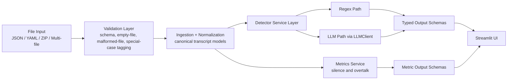

# Architecture

## Overview

This project implements a production-minded transcript analysis workflow for debt collection calls. The system is intentionally organized around reusable services and typed models so the same behavior is available to both automated tests and the Streamlit UI.

## Technology Choices

- **Python 3.11+**: modern typing support, mature ecosystem, and strong fit for data processing plus Streamlit.
- **Streamlit**: assignment-aligned UI framework with quick iteration, batch upload support, and straightforward deployment to Streamlit Community Cloud.
- **Pydantic**: strict schema validation and typed contracts for transcript ingestion, detector outputs, and error handling.
- **`re` module**: lightweight, transparent baseline for rule-based profanity and compliance detection.
- **OpenAI SDK**: official client for prompt-based classification using a configurable model.
- **pytest**: clear unit and regression testing for detectors, parsing, and edge cases.
- **python-dotenv**: secure local configuration without hardcoding secrets.
- **Plotly**: interactive visualizations that embed cleanly in Streamlit for Q3 deliverables.

## Architecture Diagram

## Service Boundaries

- **Ingestion services** convert raw uploaded files into validated canonical transcript models.
- **Detector services** execute either regex or LLM analysis while returning the same typed result shapes.
- **LLM client** centralizes prompt execution, model selection, and graceful failure when credentials are unavailable.
- **Metrics services** calculate timing-derived analytics independent of UI concerns.
- **Streamlit** remains a thin orchestration layer over shared services.

## Guard Rails

- Canonical validation before analysis
- Fixed LLM JSON schemas parsed by Pydantic
- Graceful missing-key handling for LLM features
- Explicit handling for empty files, wrong-person calls, voicemail-style calls, and single-speaker transcripts
- Regression testing for prompt changes and detector behavior

## Prompt Strategy

- Prompts are treated like versioned code artifacts in `src/call_evaluation/detectors/llm/prompts/`.
- All classification prompts use `temperature=0.0`.
- Prompts define fixed enums and forbid free-form label invention.
- Few-shot examples cover positive, negative, and noisy-transcript edge cases.
