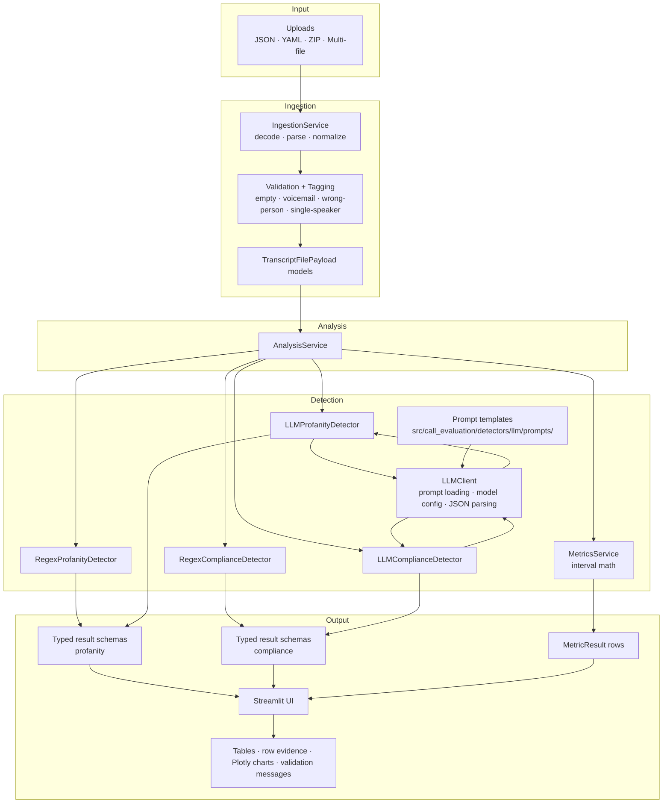

# Architecture

## Overview

This project is implemented as a batch transcript-analysis system with a thin Streamlit UI on top of reusable ingestion, detector, and metrics services. The built system supports:

- `Q1` profanity detection through both `regex` and `LLM` classification paths
- `Q2` privacy and compliance detection through both `regex` and `LLM` classification paths
- `Q3` silence and overtalk metrics derived from timestamp interval math

The UI does not contain analysis rules. It delegates file loading, detector execution, and metric generation to `src/call_evaluation/services/analysis_service.py`, which orchestrates the lower-level services.

## Technology Choices

- **Python 3.11+**
  - modern typing, clean package structure, and strong support for data-oriented services
- **Streamlit**
  - fast assignment-aligned UI, batch file handling, and simple deployment to Streamlit Community Cloud
- **Pydantic**
  - strict typed contracts for transcript models, detector outputs, and validation-safe parsing of LLM JSON
- **`re` module**
  - transparent, fast, and easy-to-debug baseline for rule-based profanity and compliance detection
- **OpenAI SDK**
  - official client for prompt-based structured classification through a shared `LLMClient`
- **pytest**
  - regression safety for ingestion, detectors, prompt parsing, and metric edge cases
- **python-dotenv**
  - local secret loading without hardcoding credentials into source control
- **Plotly**
  - interactive charting for Q3 metrics inside Streamlit

## Final Architecture Diagram

## Regex and LLM Framing

The final implementation uses a shared pipeline shape for `Q1` and `Q2`:

1. Transcripts are ingested into the same canonical payload format.
2. `AnalysisService` selects either the `regex` detector or the `LLM` detector based on the UI choice.
3. Both paths return the same typed output schema for that task.
4. The UI renders the same table and evidence layout regardless of which path produced the result.

This means the system is not two disconnected applications. It is one analysis pipeline with interchangeable detector strategies.

## Built Service Boundaries

- **IngestionService**
  - loads JSON, YAML, and ZIP input
  - validates transcript structure
  - emits canonical `TranscriptFilePayload` models
  - tags special calls such as voicemail, wrong-person, empty, and single-speaker

- **Regex detectors**
  - provide transparent baseline logic for profanity and compliance classification
  - handle adversarial tests and known edge cases through explicit rule logic

- **LLM detectors**
  - use file-based prompt templates and a shared `LLMClient`
  - require fixed JSON output parsed through Pydantic
  - degrade gracefully when `OPENAI_API_KEY` is unavailable

- **MetricsService**
  - computes total duration, agent talk time, customer talk time, silence percentage, and overtalk percentage
  - handles empty transcripts, zero duration, voicemail, zero overtalk, and single-speaker calls safely

- **Visualization helpers**
  - build the per-call bar chart, histograms, and top-N plots used by the Streamlit app

- **AnalysisService**
  - keeps the UI thin by batching ingestion outputs into:
    - profanity result tables and evidence details
    - compliance result tables and evidence details
    - metrics rows and batch reports

## Guard Rails

- Canonical transcript validation happens before analysis.
- Unsupported, empty, malformed, and parse-failed files are reported as UI errors instead of crashing the app.
- LLM prompts are stored as versioned files, not hardcoded strings.
- LLM classification uses `temperature=0.0`.
- LLM responses must satisfy fixed JSON schemas and are validated through Pydantic.
- Missing API keys disable the LLM path visibly instead of failing at runtime.
- Metrics logic handles divide-by-zero and no-speaker / one-speaker edge cases explicitly.
- Prompt regression and detector regression tests protect previously implemented behavior.

## Final Repository Roles

- [app/streamlit_app.py](/C:/Users/Vedansh%20Paliwal/Desktop/Call%20evaluation%20project/app/streamlit_app.py)
  - Streamlit interface
- [src/call_evaluation/ingestion.py](/C:/Users/Vedansh%20Paliwal/Desktop/Call%20evaluation%20project/src/call_evaluation/ingestion.py)
  - transcript loading and validation
- [src/call_evaluation/services/analysis_service.py](/C:/Users/Vedansh%20Paliwal/Desktop/Call%20evaluation%20project/src/call_evaluation/services/analysis_service.py)
  - UI-facing orchestration layer
- [src/call_evaluation/services/llm_client.py](/C:/Users/Vedansh%20Paliwal/Desktop/Call%20evaluation%20project/src/call_evaluation/services/llm_client.py)
  - shared LLM wrapper
- [src/call_evaluation/detectors/](/C:/Users/Vedansh%20Paliwal/Desktop/Call%20evaluation%20project/src/call_evaluation/detectors)
  - regex and LLM task-specific detectors
- [src/call_evaluation/metrics/call_metrics.py](/C:/Users/Vedansh%20Paliwal/Desktop/Call%20evaluation%20project/src/call_evaluation/metrics/call_metrics.py)
  - interval-based Q3 metrics
- [src/call_evaluation/visualization.py](/C:/Users/Vedansh%20Paliwal/Desktop/Call%20evaluation%20project/src/call_evaluation/visualization.py)
  - Plotly figure builders
